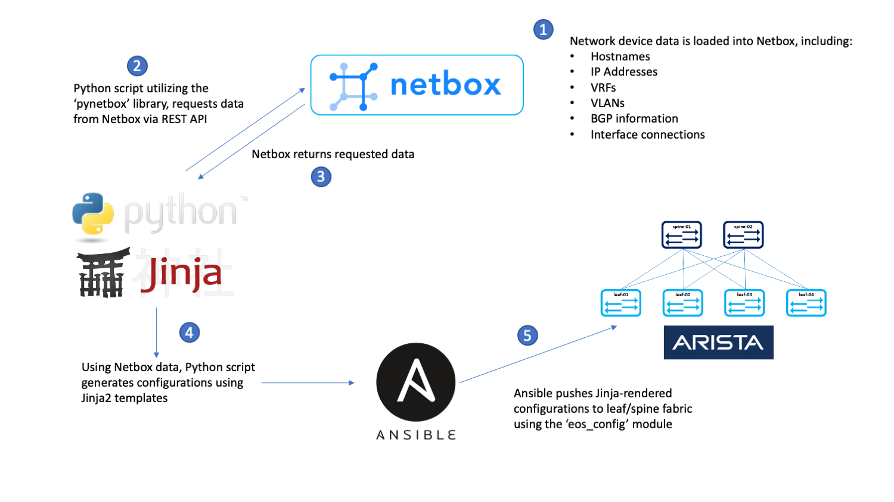
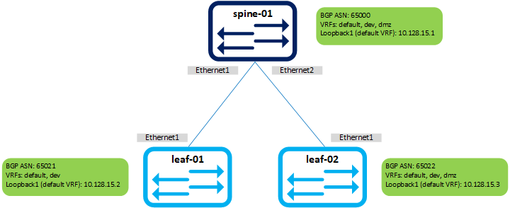
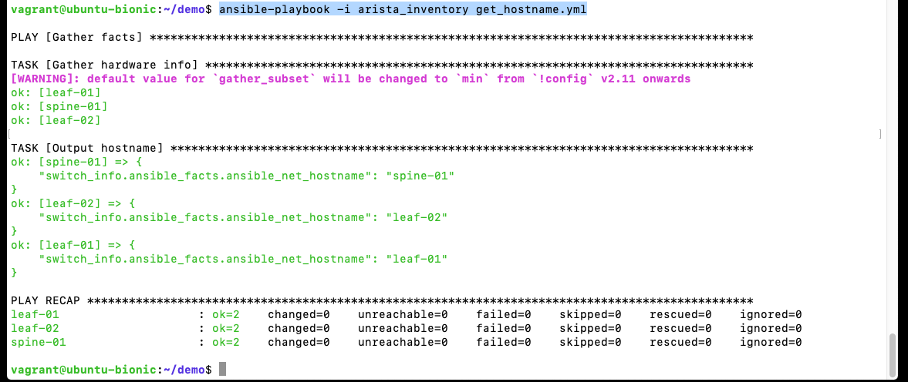

# Overview

This project creates a demo environment for a workflow that generates network device configurations using data stored in Netbox and pushes those configurations using Ansible.  See [this post](https://www.vectornetworksllc.com/post/generating-network-device-configurations-from-netbox) for more background on the motivations for creating this demo.

It employs a single Ubuntu VM deployed via Vagrant.  The VM hosts all of the services required to simulate the complete workflow:

* Netbox, run as Docker containers via [netbox-docker](https://github.com/netbox-community/netbox-docker)
* A custom Python script that queries Netbox for data and generates Arista EOS configurations, **gen-cfg**, run directly on the VM host
* Ansible, run directly on the VM host
* A basic, 3-node Arista cEOS leaf/spine topology, run as Docker containers via [docker-topo](https://github.com/networkop/docker-topo)

# Requirements

The primary requirement to run the demo is **[Vagrant](https://www.vagrantup.com/downloads)** with **[VirtualBox](https://www.virtualbox.org/wiki/Downloads)**.  However, in order to run the Arista cEOS containers you will need a copy of the cEOS lab software.  This isn't something we can provide, so if you want to run it you will need access to download the software on Arista's site.  If you can't obtain a copy of the cEOS lab software, you will still be able to generate configurations from Netbox but you won't be able to load them onto the leaf/spine topology.

# Running the Demo

## Clone the repo

    git clone https://github.com/vectornetworks/netbox-gencfg-demo.git
    cd netbox-gencfg-demo

## Download and rename the cEOS lab software
The Vagrantfile provisioning script will look for a file in the base directory (i.e. where the Vagrantfile is) called *cEOS-lab.tar*. Download the 32-bit version of EOS you would like from the Arista site, place it in the base directory, and rename it *cEOS-lab.tar*.  For example, in our case we downloaded the *cEOS-lab-4.24.4M.tar* file, placed it in the base directory, and renamed it:

    mv cEOS-lab-4.24.4M.tar cEOS-lab.tar

## Bring the VM online with Vagrant
Bring up the VM using Vagrant:

    vagrant up

This will bring the demo VM online and install Docker, Netbox, and Ansbile; and load the demo data into Netbox.  It will also add the cEOS image into Docker if it exists.

## Connect to the VM and Check the IP address
While still in the Vagrant base directory, SSH to the VM:

    vagrant ssh

This VM instantiates a host-only network which means that the guest host on which you are running it will have a NIC placed on the same network as your VM.  In order to determine the IP address of the host-only adapter, note the IP address of *enp0s8* included in the banner when you login, for example:

    IP address for enp0s8:          172.28.128.4

If you missed it upon login, you can find it again as follows:

    ip address | grep -A 2 enp0s8: | grep inet | awk '{print $2}'

## Test connectivity and login to Netbox
Using a browser on the guest host, plug in the IP address of the VM (obtained in the last step) on port 8000 to connect to Netbox (un: admin, pw: admin).  Example: http://172.28.128.4:8000/

All of the Netbox data is pre-populated, so take some time to look around.  Note the following:

* Devices
* Interaces and associated tags
* IP addresses, prefixes and associated tags
* Tags

## Turn-up cEOS containers
This demo uses a basic, 3-node Arista cEOS leaf/spine topology created using docker-topo.  

To build out the cEOS containers and apply a base configuration, perform the following on the VM (assuming you are still connected and in the home directory):

    cd docker-topo
    docker-topo --create mini-ls.yml 

In order to easily access the CLI of the cEOS containers, add the following aliases (can be copied/pasted out of docker-topo output too):

    alias leaf-01='docker exec -it mini-ls_leaf-01 Cli'
    alias leaf-02='docker exec -it mini-ls_leaf-02 Cli'
    alias spine-01='docker exec -it mini-ls_spine-01 Cli'

At this point test logging into the cEOS containers using the aliases, e.g.:

    leaf-01

**Note:** It may take a couple of minutes for the containers to come online and load their base configuration.  If you get a generic hostname or a partial config when you login to the device, check back after a couple of minutes.

Should log you into the CLI of leaf-01.  Feel free to enable up and poke around.  At this point the containers only have a base config that doesn't contain much beyond the hostname.

    en
    sh run
    exit

## Test Ansible, Push Configurations, and Validate
This is the main part of the demo that consists of generating configurations using *gen-cfg* and pushing them with Ansible.  First, change into the 'demo' directory:

    cd ~/demo

Validate that Ansible can connect to the Arista containers by running a basic playbook to check the hostnames:

    ansible-playbook -i arista_inventory get_hostname.yml

Your output should resemble the following:

Next, generate a sample configuration using gen-cfg:

    gen-cfg --hostname leaf-01

This script queries Netbox for a device's data, parses it, and renders a configuration template using Jinja2 (templates are in the 'templates' folder).  If you want, explore the configuration alongside the Netbox data in your browser window in order to try and determine how the data gets translated into configuration.  Assuming all looks good, generate configurations for the entire site (test lab) and write them to disk:

    gen-cfg --site "vagrant-test-lab" --write

This will generate configurations for all the devices at the site and drop them into the 'cfg/' directory.  Again, take a look through the configurations that have been generated to get a feel for what the script is doing. At a high level, the configurations build transit IP addressing and BGP peerings between the leafs and the spine on a few different VRFs.

Push the configurations using Ansible:

    ansible-playbook -i arista_inventory send_config.yml

This will push all of the configurations generated by gen-cfg in the 'cfg' directory to the cEOS containers.  After the configurations have been completed, login to the containers and perform some validations - sh run, sh ip bgp sum, sh ip route [vrf], sh ip int brief, ping, etc.  For example:

    spine-01
    sh ip bgp sum vrf all

Should give you BGP peerings to leaf-01 and leaf-02 on two (leaf-01) or three (leaf-02) VRFs.  Basic connectivity should work too:

    leaf-01
    ping 10.128.15.1
    ping 10.128.15.3

Will ping spine-01 and leaf-03 loopbacks in the default VRF.

That's it!  Feel free to play around with the Netbox data generating/pushing new configurations to explore how things work.

# Cleanup
Use the standard Vagrant commands from the base directory on the guest host to suspend, or destroy the VM.

If you want to save your work and come back later:

    vagrant suspend

Or to cleanup altogether:

    vagrant destroy -f